# Base Broker V0

## Índice

- [Stack técnica](#stack-técnica)
- [Como executar](#como-executar)
- [Executando testes unitários e de integração](#executando-testes-unitários-e-de-integração)
  - [Com coverage](#com-coverage)
  - [Sem coverage](#sem-coverage)
  - [Cobertura de testes atual](#cobertura-de-testes-atual)
- [Estrutura funcional](#estrutura-funcional)
- [Fluxo de dados](#fluxo-de-dados)
- [Componentes](#componentes)
  - [Dashboard](#dashboard)
  - [OrderBook](#orderbook)
  - [StockChart](#stockchart)
  - [OrderForm](#orderform)
  - [OrdersTable](#orderstable)
  - [OrderFilters](#orderfilters)
  - [OrdersTableContent](#orderstablecontent)
  - [OrderDrawer](#orderdrawer)
  - [CancelOrderConfirmation](#cancelorderconfirmation)
  - [OrderTimeLine](#ordertimeline)
- [Hooks](#hooks)
  - [useGetOrders](#usegetorders)
  - [useGetOrderBook](#usegetorderbook)
  - [useGetOrderHistory](#usegetorderhistory)
- [Serviços e contratos de API](#serviços-e-contratos-de-api)
  - [GET /orders](#get-orders)
  - [POST /orders](#post-orders)
  - [PATCH /orders/:id/cancel](#patch-ordersidcancel)
  - [GET /book](#get-book)
  - [GET /history](#get-history)
- [Regras de negócio implementadas no json server](#regras-de-negócio-implementadas-no-json-server)
  - [Criação de ordem](#criação-de-ordem)
  - [Matching de ordens](#matching-de-ordens)
  - [Histórico](#histórico)
- [Helpers relevantes](#helpers-relevantes)
  - [Formatters](#formatters)
  - [Masks](#masks)
- [Sobre testes](#sobre-testes)
- [Sobre testes](#sobre-testes)

## Stack técnica

- Node 24.14.0
- Next.js 16
- React 19
- TypeScript
- Chakra UI
- TanStack Query
- React Hook Form
- Jest + Testing Library
- json-server
- TradingView widget embed

## Como executar

Instale as dependências:

```bash
npm install
```

Suba o server JSON:

```bash
npm run server
```

Em outro terminal, suba o frontend:

```bash
npm run dev
```

Aplicação web:

- http://localhost:3000

API server JSON:

- http://localhost:3001

## Executando testes unitários e de integração

#### Com coverage

```bash
npm run test:coverage
```

#### Sem coverage

```bash
npm run test
```

#### Cobertura de testes atual

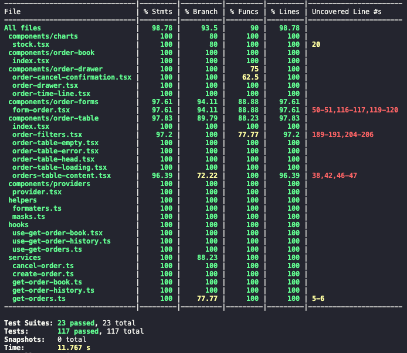

## Estrutura funcional

O dashboard principal está em [app/page.tsx](app/page.tsx) e compõe quatro áreas principais:

1. Livro de ordens: [app/components/order-book/index.tsx](app/components/order-book/index.tsx)
2. Gráfico do ativo: [app/components/charts/stock.tsx](app/components/charts/stock.tsx)
3. Formulário de ordens: [app/components/order-forms/form-order.tsx](app/components/order-forms/form-order.tsx)
4. Tabela de ordens: [app/components/order-table/index.tsx](app/components/order-table/index.tsx)

## Fluxo de dados

O padrão predominante do projeto é:

1. componente consome um hook
2. hook consome um serviço
3. serviço chama a API do server JSON em http://localhost:3001
4. resposta é normalizada e exibida pelo componente

Exemplos:

- [Componente do livro de ofertas](app/components/order-book/index.tsx) -> [Hook de ofertas](app/hooks/use-get-order-book.tsx) -> [Serviço de listagem de ofertas](app/services/get-order-book.ts)
- [Componente da tabela de ordens](app/components/order-table/index.tsx) -> [Hook de ordens](app/hooks/use-get-orders.ts) -> [Serviço de listagem de ordens](app/services/get-orders.ts)
- [Componente com o histórico da ordem](app/components/order-drawer/order-time-line.tsx) -> [Hook de histórico da ordem](app/hooks/use-get-order-history.ts) -> [Serviços de listagem do histórico da ordem](app/services/get-order-history.ts)

## Componentes

### OrderForm

Arquivo: [app/components/order-forms/form-order.tsx](app/components/order-forms/form-order.tsx)

Responsabilidades:

- criar ordens de compra ou venda
- validar ticker, preço e quantidade
- atualizar a URL com o ticker válido digitado

Props:

- `side: "BUY" | "SELL"`

Regras de negócio:

- cada formulário representa exatamente um lado da operação
- tickers válidos atualmente:
  - `PETR4`
  - `VALE3`
  - `ITUB4`
  - `BBDC4`
  - `TAEE11`
- ticker deve seguir o padrão regex `^[A-Z]{4}\d{1,2}$`
- preço é digitado como texto e convertido para número no submit
- quantidade deve ser maior ou igual a `1`
- após sucesso:
  - refetch de `orders` para atualizar os dados da tabela de ordens
  - refetch de `orderBook` para atualizar os dados do livro de ordens
  - reset do formulário

Integrações:

- serviço de criação: [app/services/create-order.ts](app/services/create-order.ts)
- endpoint de criação: `POST /orders`

Payload enviado para a API:

```json
{
  "instrument": "PETR4",
  "side": "BUY",
  "price": 100.5,
  "quantity": 50
}
```

Atualização da URL:

- quando o ticker digitado é válido, o componente executa `router.replace`
- a query string passa a conter `?ticker=<ATIVO>`
- isso é usado pelo componente que exibe os gráficos do tradingview

#### Visão do Componente

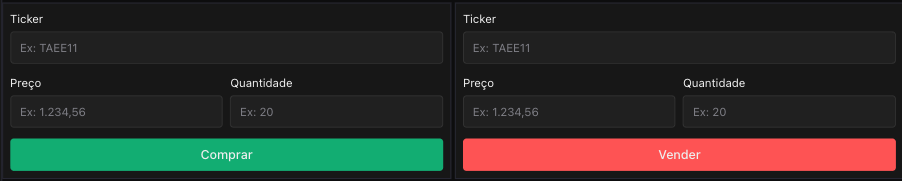


### OrdersTable

Arquivo: [app/components/order-table/index.tsx](app/components/order-table/index.tsx)

Responsabilidades:

- orquestrar listagem, filtros e estados da tabela de ordens

Regras:

- loading renderiza [app/components/order-table/order-table-loading.tsx](app/components/order-table/order-table-loading.tsx)
- erro renderiza [app/components/order-table/order-table-error.tsx](app/components/order-table/order-table-error.tsx)
- lista vazia renderiza [app/components/order-table/order-table-empty.tsx](app/components/order-table/order-table-empty.tsx)
- tabela sempre fica encapsulada por [app/components/order-table/order-filters.tsx](app/components/order-table/order-filters.tsx)

Fonte de dados:

- hook: [app/hooks/use-get-orders.ts](app/hooks/use-get-orders.ts)
- serviço: [app/services/get-orders.ts](app/services/get-orders.ts)
- endpoint: `GET /orders`

#### visão do componente

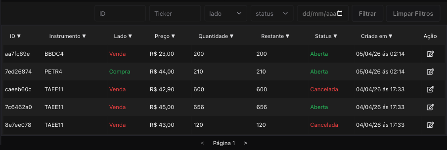

### OrderFilters

Arquivo: [app/components/order-table/order-filters.tsx](app/components/order-table/order-filters.tsx)

Responsabilidades:

- capturar filtros da tabela
- disparar busca filtrada via mutation
- controlar paginação

Campos disponíveis:

- `id` (id da ordem)
- `instrument` (ticker)
- `side` (lado)
- `status` (status da ordem)
- `date` (data de criação da ordem)

Regras de negócio:

- paginação local começa em `1`
- botão anterior nunca reduz abaixo de `1`
- botão próximo fica desabilitado quando `ordersLength < 5`
- ao limpar filtros:
  - `id`, `instrument` e `date` voltam para string vazia
  - `side` e `status` voltam para `undefined`

Integração com API:

- serviço: [app/services/get-orders.ts](app/services/get-orders.ts)
- endpoint: `GET /orders`

Parâmetros enviados:

- paginação e ordenação padrão:
  - `_page`
  - `_limit`
  - `_sort=createdAt`
  - `_order=desc`
- filtros opcionais:
  - `id_like`
  - `instrument_like`
  - `side`
  - `status`
  - `createdAt_like`

Exemplo real de query montada:

```text
/orders?_page=2&_limit=10&_sort=createdAt&_order=desc&id_like=123&instrument_like=PETR4&side=BUY&status=OPEN&createdAt_like=2026-04-03
```

#### Visão do Componente

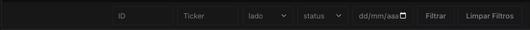

### OrdersTableContent

Arquivo: [app/components/order-table/orders-table-content.tsx](app/components/order-table/orders-table-content.tsx)

Responsabilidades:

- renderizar as linhas da tabela
- aplicar ordenação client-side sobre os dados já carregados
- abrir inoformações da ordem via drawer

Regras:

- ordenação é local no frontend
- primeiro clique em uma coluna ordenável ordena em ascendente
- clique subsequente na mesma coluna alterna para descendente
- demais campos são comparados como número ou string conforme o tipo

Campos ordenáveis:

- `id` (id)
- `instrument` (ticker)
- `side` (lado)
- `price` (preço)
- `quantity` (quantidade)
- `remaining` (quantidade restante quando há ordens parciais)
- `status` (status da ordem)
- `createdAt` (data de criação da ordem)

Dependência de ação: (abre o drawer com detalhes da ordem):

- cada linha contém [app/components/order-drawer/order-drawer.tsx](app/components/order-drawer/order-drawer.tsx)

#### Visão do Componente

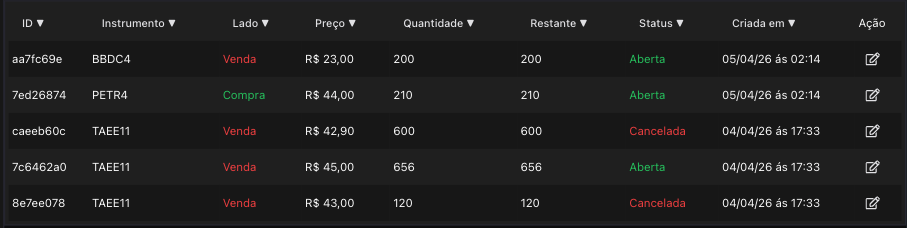

### OrderDrawer

Arquivo: [app/components/order-drawer/order-drawer.tsx](app/components/order-drawer/order-drawer.tsx)

Responsabilidades:

- exibir detalhes operacionais e histórico da ordem
- gerenciar estado de abertura/fechamento da modal de confirmação de cancelamento

Regras de negócio:

- botão de cancelamento é desabilitado para ordens com status:
  - `EXECUTED`
  - `CANCELLED`
- ao clicar no botão, abre a modal [CancelOrderConfirmation](#cancelorderconfirmation) para confirmação

Dependências:

- [app/components/order-drawer/order-cancel-confirmation.tsx](app/components/order-drawer/order-cancel-confirmation.tsx)
- [app/components/order-drawer/order-time-line.tsx](app/components/order-drawer/order-time-line.tsx)

#### Visão do Componente

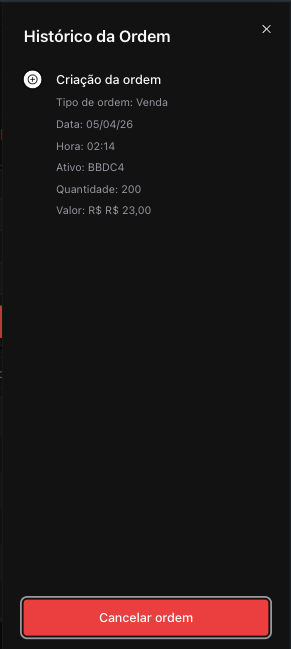

### CancelOrderConfirmation

Arquivo: [app/components/order-drawer/order-cancel-confirmation.tsx](app/components/order-drawer/order-cancel-confirmation.tsx)

Responsabilidades:

- exibir modal de confirmação para cancelamento de ordem
- validar entrada de assinatura eletrônica
- executar a mutação de cancelamento
- gerenciar refetch de dados após cancelamento bem-sucedido

Props:

- `open: boolean` - controla visibilidade da modal
- `onClose: (value: boolean) => void` - callback para fechar modal
- `orderId: string` - ID da ordem a ser cancelada

Regras de negócio:

- cancelamento só pode ser executado com campo de assinatura eletrônica preenchido
- ao confirmação, executa a mutação de cancelamento da ordem
- após sucesso:
  - refetch de `orders` para atualizar dados da tabela
  - refetch de `history` para atualizar histórico da ordem
  - fecha a modal
- modal fecha ao clicar em "Fechar", botão X ou pressionar Esc

Integração com API:

- serviço: [app/services/cancel-order.ts](app/services/cancel-order.ts)
- endpoint: `PATCH /orders/:id/cancel`

#### Visão do Componente

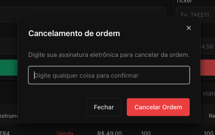


### OrderTimeLine

Arquivo: [app/components/order-drawer/order-time-line.tsx](app/components/order-drawer/order-time-line.tsx)

Responsabilidades:

- exibir a linha do tempo da ordem
- mostrar criação, execuções parciais, execução final ou cancelamento

Fonte de dados:

- hook: [app/hooks/use-get-order-history.ts](app/hooks/use-get-order-history.ts)
- serviço: [app/services/get-order-history.ts](app/services/get-order-history.ts)
- endpoint: `GET /history?orderId=<id>&_sort=timestamp`

Regras:

- sempre renderiza primeiro o bloco de criação da ordem
- eventos seguintes vêm da coleção `history`

#### Visão do Componente

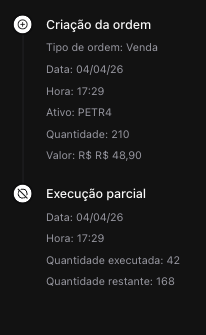


### OrderBook

Arquivo: [app/components/order-book/index.tsx](app/components/order-book/index.tsx)

Responsabilidade:

- exibir o livro de ofertas separado por venda e compra
- mostrar o preço médio entre compradores e vendedores
- lidar com estados de loading e erro

Regras de negócio:

- o preço médio é exibido apenas quando a API devolve `midPrice`
- caso `midPrice` seja `null`, mostra `Sem preço médio`

Origem dos dados:

- hook: [app/hooks/use-get-order-book.tsx](app/hooks/use-get-order-book.tsx)
- serviço: [app/services/get-order-book.ts](app/services/get-order-book.ts)
- endpoint: `GET /book`

Resposta:

```json
{
  "buyOrders": [{
      "id": "973716d0-b894-4c57-8e5f-1869ee892eb5",
      "orderId": "ad89c88e-37a3-475c-885e-0729caa7736a",
      "side": "BUY",
      "status": "PARTIAL",
      "tradedQuantity": 340,
      "remaining": 360,
      "price": 43,
      "timestamp": "2026-04-03T02:34:04.272Z"
    },],
  "sellOrders": [{
      "id": "4574bce2-6ab4-4d9b-adbe-7163d829f119",
      "orderId": "c89e50a2-7f0e-4691-a034-12aeaa76fd8b",
      "side": "SELL",
      "status": "EXECUTED",
      "tradedQuantity": 340,
      "remaining": 0,
      "price": 43,
      "timestamp": "2026-04-03T02:34:04.272Z"
    }],
  "midPrice": 25.73
}
```

#### Visão do Componente

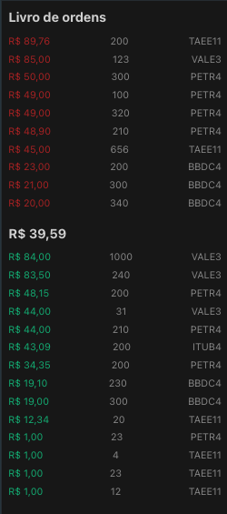

### StockChart

Arquivo: [app/components/charts/stock.tsx](app/components/charts/stock.tsx)

Responsabilidade:

- incorporar o widget do TradingView dentro da aplicação
- ler o ticker da URL e chamar o gráfico a ser exibido

Regras:

- se a query string não tiver `ticker`, usa `PETR4`
- o símbolo final enviado ao TradingView é `BMFBOVESPA:${ticker}`
- o componente reinjeta o script sempre que `interval` ou `ticker` mudam

Fonte de dados:

- não consome endpoint da API local
- carrega script externo do TradingView

Parâmetros aceitos pelo componente:

- `interval?: string` com default `60`
- `height?: number` com default `380`

Observação:

- este componente depende de embed externo, portanto os testes deste componente validam apenas a integração local, não o comportamento interno do TradingView

#### Visão do Componente

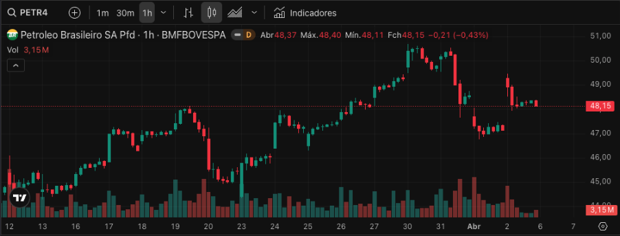

### Dashboard

Arquivo: [app/page.tsx](app/page.tsx)

Responsabilidades:

- montar o layout principal da aplicação
- organizar visualmente livro, gráfico, formulários e tabela

Regras:

- não contém regra de negócio relevante
- atua apenas como componente de composição

Dependências diretas:

- [app/components/order-book/index.tsx](app/components/order-book/index.tsx)
- [app/components/charts/stock.tsx](app/components/charts/stock.tsx)
- [app/components/order-forms/form-order.tsx](app/components/order-forms/form-order.tsx)
- [app/components/order-table/index.tsx](app/components/order-table/index.tsx)

#### Visão do Componente

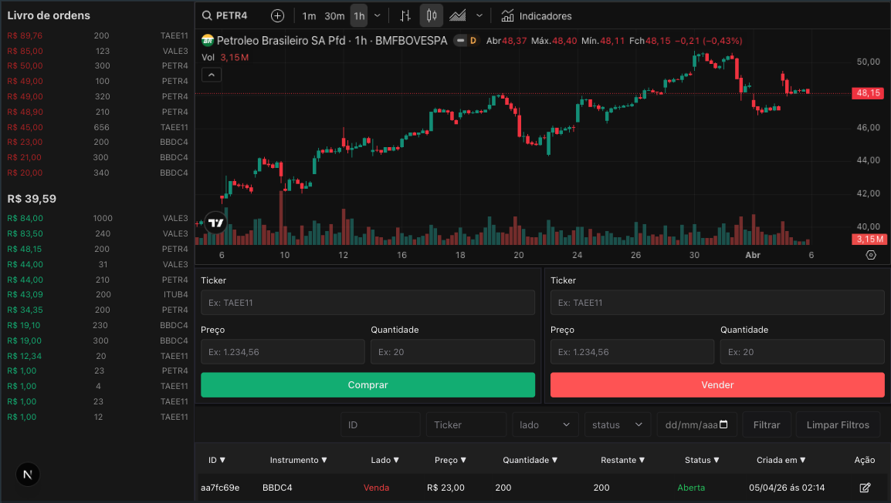

## Hooks

### useGetOrders

Arquivo: [app/hooks/use-get-orders.ts](app/hooks/use-get-orders.ts)

Responsabilidade:

- encapsular a consulta de ordens com React Query

Observações:

- usa `queryKey: ["orders"]`
- delega a busca para [app/services/get-orders.ts](app/services/get-orders.ts)

### useGetOrderBook

Arquivo: [app/hooks/use-get-order-book.tsx](app/hooks/use-get-order-book.tsx)

Responsabilidade:

- encapsular a consulta do livro de ordens

Observações:

- usa `queryKey: ["orderBook"]`
- delega a busca para [app/services/get-order-book.ts](app/services/get-order-book.ts)

### useGetOrderHistory

Arquivo: [app/hooks/use-get-order-history.ts](app/hooks/use-get-order-history.ts)

Responsabilidade:

- consultar o histórico de uma ordem específica

Observações:

- usa `queryKey: ["history", orderId]`
- delega a busca para [app/services/get-order-history.ts](app/services/get-order-history.ts)

## Serviços e contratos de API

### GET /orders

Implementação do cliente:

- [app/services/get-orders.ts](app/services/get-orders.ts)

Uso principal:

- listagem principal de ordens
- filtros e paginação da tabela

Parâmetros possíveis:

- `_page`
- `_limit`
- `_sort`
- `_order`
- `id_like`
- `instrument_like`
- `side`
- `status`
- `createdAt_like`

Response:

```JSON
[{
      "id": "ad89c88e-37a3-475c-885e-0729caa7736a",
      "instrument": "PETR4",
      "side": "BUY",
      "price": 43,
      "quantity": 700,
      "remaining": 360,
      "status": "CANCELLED",
      "createdAt": "2026-04-03T02:33:10.603Z"
}]
```

### POST /orders

Implementação do cliente:

- [app/services/create-order.ts](app/services/create-order.ts)

Body request:

```json
{
  "instrument": "PETR4",
  "side": "BUY",
  "price": 100.5,
  "quantity": 50
}
```

Response:

```JSON
{
    "id": "90ab37c2-31f5-4d01-a5c4-7631add6362d",
    "instrument": "PETR4",
    "side": "BUY",
    "price": 50,
    "quantity": 10,
    "remaining": 0,
    "status": "OPEN", // se der match o status já vem como EXECUTED
    "createdAt": "2026-04-05T02:54:48.485Z"
}
```

### PATCH /orders/:id/cancel

Implementação cliente:

- [app/services/cancel-order.ts](app/services/cancel-order.ts)

Response: 

```JSON
{
    "id": "7ed26874-ec2b-4351-8059-a3e25917215a",
    "instrument": "PETR4",
    "side": "BUY",
    "price": 44,
    "quantity": 210,
    "remaining": 210,
    "status": "CANCELLED",
    "createdAt": "2026-04-05T02:14:31.440Z"
}
```

### GET /book

Implementação cliente:

- [app/services/get-order-book.ts](app/services/get-order-book.ts)

Response:

```json
{
  "buyOrders": [{
      "id": "973716d0-b894-4c57-8e5f-1869ee892eb5",
      "orderId": "ad89c88e-37a3-475c-885e-0729caa7736a",
      "side": "BUY",
      "status": "PARTIAL",
      "tradedQuantity": 340,
      "remaining": 360,
      "price": 43,
      "timestamp": "2026-04-03T02:34:04.272Z"
    },],
  "sellOrders": [{
      "id": "4574bce2-6ab4-4d9b-adbe-7163d829f119",
      "orderId": "c89e50a2-7f0e-4691-a034-12aeaa76fd8b",
      "side": "SELL",
      "status": "EXECUTED",
      "tradedQuantity": 340,
      "remaining": 0,
      "price": 43,
      "timestamp": "2026-04-03T02:34:04.272Z"
    }],
  "midPrice": 25.73
}
```

### GET /history

Implementação cliente:

- [app/services/get-order-history.ts](app/services/get-order-history.ts)

Parâmetros usados:

- `orderId`
- `_sort=timestamp`

Response:

```JSON
[
    {
        "id": "b949ad89-c854-4df1-83ed-481a39e4dd76",
        "orderId": "a7e53510-3a35-4ba9-bd07-3bc1f1665347",
        "side": "SELL",
        "status": "PARTIAL",
        "tradedQuantity": 42,
        "remaining": 168,
        "price": 48.9,
        "timestamp": "2026-04-04T17:29:24.447Z"
    },
    {
        "id": "828bd364-f048-4e97-b5ae-542ab6850788",
        "orderId": "a7e53510-3a35-4ba9-bd07-3bc1f1665347",
        "side": "SELL",
        "status": "PARTIAL",
        "tradedQuantity": 10,
        "remaining": 158,
        "price": 48.9,
        "timestamp": "2026-04-05T02:54:48.487Z"
    }
]
```

# JSON SERVER ( Back-end )

## Regras de negócio implementadas no json server

Arquivo: [json-server/server.js](json-server/server.js)

### Criação de ordem

Ao receber `POST /orders`, o backend:

1. gera `id`
2. inicializa `remaining` usando o valor do `quantity`
3. define status inicial como `OPEN`
4. salva a ordem
5. executa matching com ordens opostas do mesmo ativo

### Matching de ordens

Uma ordem só casa com outra quando:

- o ativo é o mesmo
- o lado é oposto
- a contraparte está em `OPEN` ou `PARTIAL`
- a regra de preço for satisfeita:
  - compra casa se `order.price >= candidate.price`
  - venda casa se `order.price <= candidate.price`

Consequências do matching:

- atualiza `remaining`
- atualiza status para `PARTIAL` ou `EXECUTED`
- grava histórico para as duas ordens envolvidas

### Histórico

Cada alteração na ordem grava um item em `history` com:

- `orderId`
- `side`
- `status`
- `tradedQuantity`
- `remaining`
- `price`
- `timestamp`

## Helpers relevantes

### Formatters

Arquivo: [app/helpers/formaters.ts](app/helpers/formaters.ts)

Responsabilidade:

- formatat.currency: formata moeda em pt-BR (BRL)
- formatat.date formata data em UTC
- formatat.hour formata hora em UTC
- formatat.side: formata lado da opertação para exibição (SELL => Compra)
- formatat.status: formata status para exibição (EXECUTED => Excutado)

### Masks

Arquivo: [app/helpers/masks.ts](app/helpers/masks.ts)

Responsabilidade:

- mascara para inpouts que recebem valores monetários

## Sobre testes

O projeto possui uma cobertura relevante.

Diretriz usada na suíte:

- teste de unidade
- teste de integração do componente com seus contratos
- centralizar mocks globais em [jest.setup.ts](jest.setup.ts)
- utilizar o pattern test da builder para mocks

Exemplos de mocks globais já existentes:

- `fetch`
- componentes Chakra UI necessários para os testes
- `next/navigation`

## Resumo final

Itens, funcionalidades e regras solicitadas no teste:

- [x] Visualização de Ordens e Datagrid com colunas:
  - [x] ID
  - [x] Instrumento
  - [x] Lado (Compra/Venda)
  - [x] Preço
  - [x] Quantidade
  - [x] Quantidade Restante
  - [x] Status
  - [x] Data/Hora

- [x] Filtros de Ordens:
  - [x] Filtro por ID
  - [x] Filtro por instrumento
  - [x] Filtro por status
  - [x] Filtro por data
  - [x] Filtro por lado
  - [x] Ordenação
  - [x] Paginação

- [x] Detalhes da Ordem:
  - [x] Modal/página com informações completas da ordem
  - [x] Histórico de alterações de status

- [x] Criação de Ordem:
  - [x] Formulário de criação com validações
  - [x] Toda ordem criada inicia com status "Aberta"

- [x] Cancelamento de Ordem:
  - [x] Fluxo de cancelamento com confirmação
  - [x] Apenas ordens com status "Aberta" ou "Parcial" podem ser canceladas

- [x] Lógica de Execução de Ordens:
  - [x] Uma ordem é executada quando existe contraparte compatível (preço igual ou mais agressivo) e quantidade disponível
  - [x] Quando a quantidade da ordem corresponde exatamente à contraparte, ambas são marcadas como "Executada"
  - [x] Quando a quantidade da ordem é maior que a contraparte, a ordem original fica como "Parcial" e sua quantidade restante é atualizada