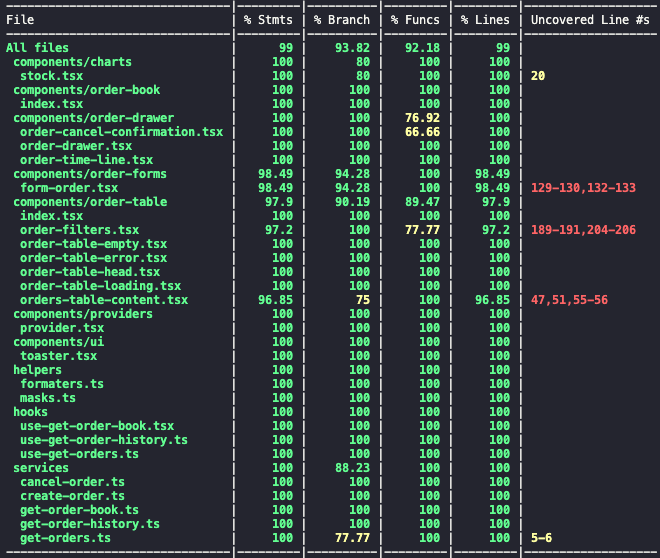
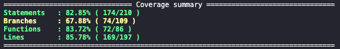

# Base Broker

Dashboard de operações: livro de ofertas, execução de ordens (com motor de matching), histórico e gráfico de ativo. Teste técnico para a BASE.

[](https://www.youtube.com/watch?v=rcOppDwUmsQ)

## Índice

- [Stack e decisões técnicas](#stack-e-decisões-técnicas)
- [Como rodar](#como-rodar)
- [Arquitetura](#arquitetura)
- [Fluxo de dados](#fluxo-de-dados)
- [Testes](#testes)
- [Motor de matching](#motor-de-matching)
- [API](#api)
- [Resumo do escopo entregue](#resumo-do-escopo-entregue)

## Stack e decisões técnicas

| Tecnologia | Por quê |
| --- | --- |
| Next.js 16 + React 19 + TypeScript | App Router, tipagem forte de ponta a ponta |
| **Chakra UI** | Componentes acessíveis (a11y de base) e sistema de tokens/tema pronto — evita reinventar primitivos de UI (modal, drawer, toast, form controls) e reduz CSS a mão sob o tempo de um teste técnico, sem abrir mão de consistência visual |
| **TanStack Query** | Cache, refetch e mutations sem estado global manual; cada domínio expõe seu próprio hook (`useGetOrders`, `useGetOrderBook`...) já com loading/error resolvidos |
| React Hook Form | Formulário não controlado (menos re-render) com validação declarativa no `OrderForm` |
| json-server + Express custom | Backend fake com motor de matching de ordens real implementado em cima (`json-server/server.js`), para demonstrar a regra de negócio sem precisar de um banco de verdade |
| Jest + Testing Library + Cypress | Unitário/integração + e2e |

## Como rodar

```bash
npm install
npm run dev:all   # sobe json-server (3001) + Next.js (3000) juntos
```

Ou separadamente: `npm run server` (API) e `npm run dev` (front), em terminais distintos.

- App: <http://localhost:3000>
- API: <http://localhost:3001>

## Arquitetura

O código de negócio é organizado por **domínio**, não por camada técnica. `app/` é só a casca de rotas do Next.js; toda a lógica vive em `modules/`:

```text
modules/
  order-book/   # livro de ofertas (leitura de mercado)
  orders/       # ciclo de vida da ordem: criar, cancelar, listar, histórico
  market/       # gráfico do ativo (TradingView)
  shared/       # UI/infra cross-domínio, helpers, tipos genéricos, test utils
    <domínio>/
      components/  hooks/  services/  types/
      index.ts     # única porta pública do módulo
```

Cada módulo só expõe o que está no seu `index.ts`. Uma regra de ESLint (`no-restricted-imports`, em [eslint.config.mjs](eslint.config.mjs)) bloqueia qualquer import que tente alcançar `components/`, `hooks/`, `services/` ou `types/` de outro módulo diretamente — o import cross-domínio só pode passar pelo barrel público (`@/modules/orders`, nunca `@/modules/orders/services/get-orders`).

### Tipos de módulo

- **feature** — domínio de negócio fechado, com tela(s) e regra própria: `order-book`, `orders`, `market`. É a unidade que aparece no produto e o que um dev abre primeiro para trabalhar em uma funcionalidade.
- **shared** — código transversal, sem regra de negócio de domínio nenhum: UI base (`Toaster`, `Provider`), helpers (`format`, `masks`), tipos genéricos (`OrderSide`, `OrderStatus`) e utilitários de teste (`modules/shared/test`). Qualquer feature pode depender de `shared`; `shared` nunca depende de uma feature — é a regra que evita dependência circular entre os dois.
- **common** — código compartilhado *dentro* de um único domínio que cresceu em múltiplas features (ex.: se `orders` um dia virar `orders/list`, `orders/detail`, `orders/refund`, o que for comum às três vai para `orders/common`, não para `shared`). Ainda não existe neste projeto porque nenhum domínio precisou se dividir, mas é o degrau natural antes de promover algo para `shared`: só sobe pra `shared` o que serve a mais de um domínio, não só a um.

Por que isso importa:

- **Onboarding**: um dev novo abre `modules/orders/` e encontra tudo sobre ordens ali dentro — não precisa pular entre pastas técnicas espalhadas (`components/`, `hooks/`, `services/`) para entender uma única feature.
- **Sem dependência circular por acidente**: como cada módulo só é acessível pelo `index.ts`, o grafo de dependências entre domínios fica explícito e visível no próprio import (`order-book` depende de `orders` porque importa `@/modules/orders`, nunca o inverso). A regra do ESLint torna esse contrato executável, não só uma convenção de documentação.
- **Escala sem fricção**: uma feature nova é uma pasta nova em `modules/`; não infla os módulos existentes nem exige reorganizar `components/` ou `services/` compartilhados.
- **Performance/bundle previsível**: como cada módulo só reexporta sua API pública pelo barrel, tree-shaking e code-splitting por rota ficam mais previsíveis, e dá pra isolar um domínio inteiro atrás de `next/dynamic` sem arrastar módulos que não têm relação.
- **Testes sem acoplamento indevido**: utilitários de teste compartilhados (builders, render wrappers) ficam em `modules/shared/test`, importados por caminho direto — não pelo barrel principal de `shared` — para não puxar dependências de UI/infra desnecessárias para dentro de um mock de domínio.

## Fluxo de dados

`componente → hook (TanStack Query) → serviço (fetch) → json-server`

Exemplo: [OrderBook](modules/order-book/components/order-book.tsx) → [useGetOrderBook](modules/order-book/hooks/use-get-order-book.tsx) → [get-order-book](modules/order-book/services/get-order-book.ts) → `GET /book`.

## Testes

```bash
npm test              # unitário/integração
npm run test:coverage # com cobertura
npm run e2e:ci         # e2e headless (sobe app + roda Cypress)
```

Diretrizes: unidade + integração componente↔hook↔serviço, mocks globais centralizados em [jest.setup.ts](jest.setup.ts), pattern builder para massa de teste (`modules/shared/test/mocks`).




## Motor de matching

Implementado em [json-server/server.js](json-server/server.js):

1. `POST /orders` cria a ordem com status `OPEN` e `remaining = quantity`.
2. Busca contrapartes do mesmo ativo, lado oposto, em `OPEN`/`PARTIAL`, com preço compatível (compra casa se `price >= contraparte.price`, venda se `price <= contraparte.price`).
3. A cada match: atualiza `remaining`, recalcula status (`PARTIAL` ou `EXECUTED`) e grava um registro em `history` para as duas pontas.
4. Cancelamento (`PATCH /orders/:id/cancel`) só é permitido em `OPEN`/`PARTIAL`.

## API

| Método | Rota | Cliente |
| --- | --- | --- |
| GET | `/orders` (filtros + paginação) | [get-orders.ts](modules/orders/services/get-orders.ts) |
| POST | `/orders` | [create-order.ts](modules/orders/services/create-order.ts) |
| PATCH | `/orders/:id/cancel` | [cancel-order.ts](modules/orders/services/cancel-order.ts) |
| GET | `/book` | [get-order-book.ts](modules/order-book/services/get-order-book.ts) |
| GET | `/history?orderId=` | [get-order-history.ts](modules/orders/services/get-order-history.ts) |

## Resumo do escopo entregue

- [x] Datagrid de ordens (ID, instrumento, lado, preço, quantidade, restante, status, data/hora)
- [x] Filtros (ID, instrumento, status, data, lado), ordenação e paginação
- [x] Detalhe da ordem em drawer, com histórico de status
- [x] Criação de ordem com validação, status inicial `OPEN`
- [x] Cancelamento com confirmação, restrito a `OPEN`/`PARTIAL`
- [x] Motor de execução: match integral (`EXECUTED`) ou parcial (`PARTIAL`) por preço/quantidade
